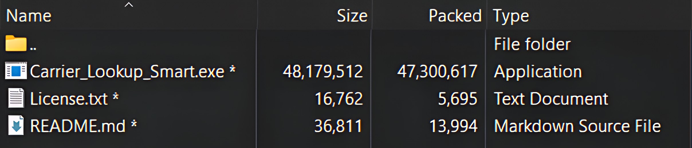
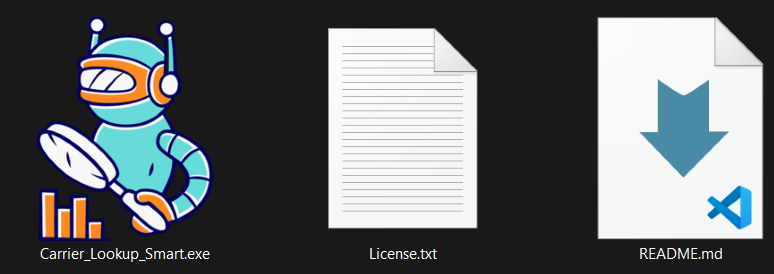

# Carrier Lookup Smart
## Product Proposal

**Prepared for freight, brokerage, dispatch, compliance, onboarding, insurance, and factoring workflows**

Carrier Lookup Smart is a private Windows application for researching motor carriers and processing carrier lists at scale. It combines live public-source lookups, configurable qualification rules, and practical report exports in one local browser-based workflow.

This proposal describes the product and its authorized distribution model. The executable is not published in this repository.

## 1. The Problem

Carrier research often means moving between several public websites, repeating the same searches, copying fields into spreadsheets, and manually deciding which records meet a team's working criteria. That process is slow, difficult to repeat consistently, and hard to audit when the volume grows.

Teams may need to:

- investigate one carrier from a DOT number, docket, contact detail, officer, or company name;
- screen a range or list of carrier identifiers;
- compare authority, insurance, fleet, driver, and inspection information;
- apply the same qualification rules to every record; and
- retain usable records and reports for follow-up.

## 2. Proposed Solution

Carrier Lookup Smart provides two connected workflows:

1. **Single-carrier research** for quickly opening a detailed carrier record.
2. **Bulk extraction** for processing ranges or lists, filtering records, and exporting the accepted results. It generates 1000s of Leads in seconds.

The application runs on the user's Windows computer, starts a local web server, and opens the interface in Microsoft Edge or Google Chrome. Source requests are made to the documented public services; the application does not ship an offline copy of carrier data.

## 3. How It Works

```text
Identifier or list
        |
        v
Search / extraction engine
        |
        +--> Public source requests
        |
        +--> Qualification rules
        |
        v
Carrier records, session history, and reports
```

The application can search by DOT number, MC/MX docket, email, phone, officer name, or company name. Bulk inputs can be a numeric range, pasted list, or `.txt`, `.csv`, or `.log` file. Duplicate identifiers are removed from pasted or uploaded lists, and bulk requests are batched with retries and optional pacing.

## 4. Product Capabilities

### Research

- Detailed carrier cards with identity, DBA, dockets, entity type, address, contacts, authority, insurance, USDOT status, fleet, drivers, inspections, VINs, and related companies.
- Broad searches with paginated results and on-demand detail loading.
- One-Click Copy buttons for useful MC, DOT, Email, Phone number and VIN fields.
- Optional FMCSA badges and address flags.
- One-click VIN decoding through NHTSA vPIC.
- One-click officer-name pronunciation which helps users pronounce officer names correctly, especially those who are less confident with pronunciation.
- Links to related Major external carrier pages on Safer, Fleetfax, BrokerSnapshot, and Motus.

### Bulk extraction

- DOT or MC/MX range processing.
- Pasted identifiers or uploaded text/CSV/log files.
- Live progress, valid and rejected counts, throughput, ETA, elapsed time, and event log.
- Clean stop support, checkpointed CSV writing, retries, optional pacing, and optional source-response caching.

### Rules and outputs

Rules can include entity type, operation classification, country, state, cargo, keyword exclusions, authority level, insurance age, fleet size, vehicle and driver counts, active USDOT status, and active insurance.

Outputs include:

- a fixed 56-column UTF-8 CSV record file;
- a self-contained, filterable and sortable HTML report;
- a printable PDF daily report; and
- HTML or PDF exports of current results of SEARCH page.
- The output also displays the current live time for the entity's state.

The application also stores local session history, report history, and cache controls, and provides an Advance Register workflow for carrier PDFs placed in the daily register folder.


## 5. Typical Workflow

1. Start the authorized executable.
2. Add optional API keys in the local `.env` file when needed.
3. Search a carrier or open the Dashboard for a bulk run.
4. Select a DOT/MC input method and provide the identifiers.
5. Configure and save the qualification rules.
6. Start extraction and monitor the live session.
7. Review accepted and rejected results.
8. Open the generated CSV, HTML, or PDF report from the local output folder.
9. Keep API keys, logs, session data, and business reports private.

## 6. Requirements

- Windows 10 or Windows 11, 64-bit.
- Microsoft Edge or Google Chrome.
- Internet access for live data requests.
- No Python installation or administrator rights.
- 8 GB RAM recommended; 4 GB is practical for single lookups and small ranges.
- Approximately 80 MB for the executable, plus space for generated reports.

Optional configuration values:

| Variable | Purpose |
|---|---|
| `SOCRATA_APP_TOKEN` | Recommended for more reliable attribution and bulk requests. |
| `FMCSA_WEB_KEY` | Enables the optional FMCSA carrier, out-of-service, and cargo overlay. |

## 7. Data Sources And Boundaries

The product documentation identifies these services:

- US DOT Socrata open-data datasets for census, authority, insurance, out-of-service, and inspection records.
- FMCSA QCMobile when the optional FMCSA integration is enabled.
- NHTSA vPIC for VIN decoding.

Carrier Lookup Smart presents third-party public data. It does not create, verify, or guarantee that data. Source availability, schema changes, freshness, completeness, and rate limits remain outside the application's control.

The product is a research and screening aid, not a compliance system. It can generate 1000s of Leads in seconds.

## 8. Tutorial

Watch the supplied walkthrough directly in the proposal:

<video controls playsinline preload="metadata" width="100%">
    <source src="https://res.cloudinary.com/dmh3yyu3p/video/upload/v1790111260/Tutorial-Final_uvdtz5.mp4" type="video/mp4">
    Your browser does not support inline video.
    <a href="https://res.cloudinary.com/dmh3yyu3p/video/upload/v1790111260/Tutorial-Final_uvdtz5.mp4">Open the tutorial video</a>.
</video>


You can also [open the tutorial video](https://res.cloudinary.com/dmh3yyu3p/video/upload/v1790111260/Tutorial-Final_uvdtz5.mp4) in a separate player.

The video is included as a repository reference asset. Authorized software packages also include a product README with installation, configuration, usage, output, and limitation details.

## 9. Distribution Package

Authorized users receive a separate password-protected ZIP. It contains:

```text
Carrier_Lookup_Smart.zip/
|- Carrier_Lookup_Smart.exe
|- README.md
|- License.txt
```





The executable and protected ZIP are deliberately not published in this documentation repository. The password should be provided only through the owner's authorized delivery channel.

## 10. License And Ownership

Carrier Lookup Smart is proprietary software owned and published by Muhammad Abdullah, trading as HAULIXX LOGISTICS. The software is licensed, not sold. Authorized use is governed by the `License.txt` file supplied with the package.

The product license generally permits authorized internal business use and one archival backup, subject to the named-user and installation limits stated by the owner. It does not permit copying, modification, reverse engineering, resale, sublicensing, public uploading, or unauthorized sharing.

See [LICENSE](LICENSE) for the repository terms and [License](License) for the distributed software EULA.

## 11. Next Step

For access, licensing questions, additional seats, or a commercial discussion, contact **Muhammad Abdullah** at [abdullahtemp4@gmail.com](mailto:abdullahtemp4@gmail.com).